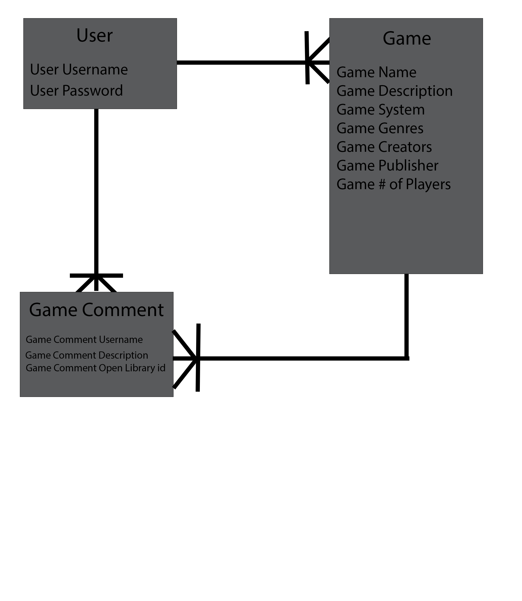
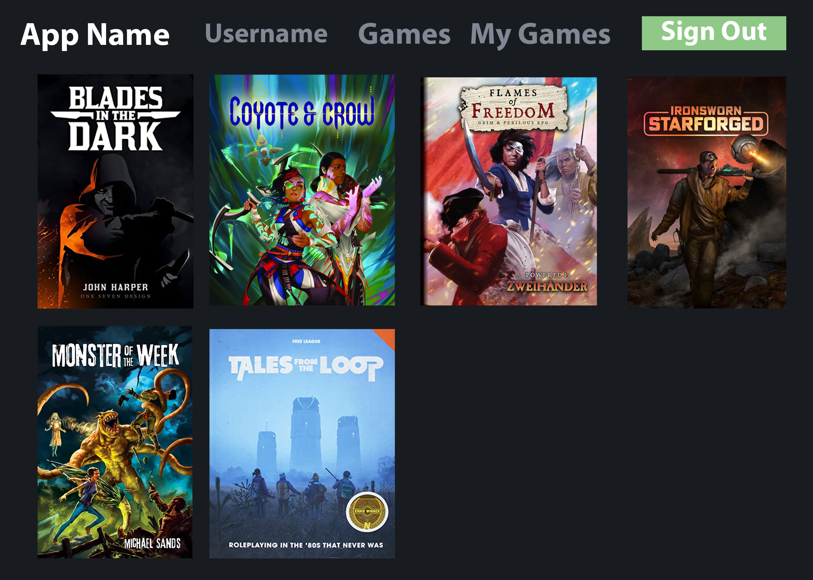

   <h1>:game_die: TTRPG Tracker :game_die:</h1>
   <h3><a href="https://ttrpgtracker.herokuapp.com/">https://ttrpgtracker.herokuapp.com/</a></h3>                           
   
    
   

<h1>:books: Description</h1>

TTRPG Tracker is an app to keep track of your tabletop RPG book collection. As a user you can view books, add books to your collection, remove books from your collection, add new books, sort the books, and add comments to a book's page.

<h2> :atom_symbol: Getting Started </h2>

<h3> :calling: Instructions </h3>

Installation

<ul>
    <li>Fork and Clone this Repo</li>
    <li>Install the necessary dependencies by copying the code below (or see dependencies to install individually):  <code>npm install @popperjs/core bcryptjs connect-mongo dotenv express express-session liquid-express-views method-override mongoose morgan</code></li>
    <li>run <code>npm seed</code> to seed the database from <code>seed.js</code></li>
    <li>run <code>npm start</code> and go to <code>localhost:3000</code> in your browser to view</li>
</ul>

Dependencies

<ul>
    <li><a href="https://www.npmjs.com/package/@popperjs/core">@Popper JS/Core</a> <code>npm i @popperjs/core</code></li>
    <li><a href="https://www.npmjs.com/package/bcrypt">Bcrypt</a> <code>npm i bcrypt</code></li>
    <li><a href="https://www.npmjs.com/package/connect-mongo">Connect-Mongo</a> <code>npm i connect-mongo</code></li>
    <li><a href="https://www.npmjs.com/package/dotenv">Dotenv</a> <code>npm i dotenv</code></li>
    <li><a href="https://www.npmjs.com/package/express">Express</a> <code>npm i express</code></li>
    <li><a href="https://www.npmjs.com/package/express-session">Express-Session</a> <code>npm i express-session</code></li>
    <li><a href="https://www.npmjs.com/package/liquid-express-views">Liquid-Express-Views</a> <code>npm i liquid-express-views</code></li>
    <li><a href="https://www.npmjs.com/package/method-override">Method-Override</a> <code>npm i method-override</code></li>
    <li><a href="https://www.npmjs.com/package/mongoose">Mongoose</a> <code>npm i mongoose</code></li>
    <li><a href="https://www.npmjs.com/package/morgan">Morgan</a> <code>npm i morgan</code></li>
</ul>

<h1>:arrow_right: Routes</h1>

 Comment

| Verb   | URI Pattern                         | Controller#Action              |
|--------|-------------------------------------|--------------------------------|
| POST   | `/games/:gameId`                    | `games#gameId`                 |
| DELETE | `/games//delete/:gameId/:commId`    | `games#delete#gameId#commId`   |

 Games

| Verb   | URI Pattern                         | Controller#Action              |
|--------|-------------------------------------|--------------------------------|
| GET    | `/`                                 | `games#`                       |
| GET    | `/coyoteandcrow`                    | `games#/coyoteandcrow`          |
| GET    | `/dnd`                              | `games#dnd`                    |
| GET    | `/fitd`                             | `games#fitd`                   |
| GET    | `/forgediniron`                     | `games#forgediniron`           |
| GET    | `/osr`                              | `games#osr`                    |
| GET    | `/pbta`                             | `games#pbta`                   |
| GET    | `/stellarremnants`                  | `games#stellarremnants`        |
| GET    | `/cyberpunk`                        | `games#cyberpunk`              |
| GET    | `/fantasy`                          | `games#fantasy`                |
| GET    | `/darkfantasy`                      | `games#darkfantasy`            |
| GET    | `/scifi`                            | `games#scifi`                  |
| GET    | `/sciencefantasy`                   | `games#sciencefantasy`         |
| GET    | `/steampunk`                        | `games#steampunk`              |
| GET    | `/urbanfantasy`                     | `games#urbanfantasy`           |
| GET    | `/genreagnostic`                    | `games#genreagnostic`          |
| GET    | `/gm`                               | `games#gm`                     |
| GET    | `/gmless`                           | `games#gmless`                 |
| GET    | `/solo`                             | `games#solo`                   |
| GET    | `/mine`                             | `games#mine`                   |
| GET    | `/new`                              | `games#new`                    |
| POST   | `/`                                 | `games#`                       |
| POST   | `/newfave`                          | `games#newfave`                |
| GET    | `/:id/edit`                         | `games#:id#edit`               |
| PUT    | `/:id`                              | `games#:id#`                   |
| GET    | `/:id`                              | `games#:id#`                   |
| DELETE | `/:id`                              | `games#:id#`                   |

 Home

| Verb   | URI Pattern                         | Controller#Action              |
|--------|-------------------------------------|--------------------------------|
| GET    | `/`                                 | `/`                            |

 User

| Verb   | URI Pattern                         | Controller#Action              |
|--------|-------------------------------------|--------------------------------|
| POST   | `/auth/signup`                      | `users#signup`                 |
| POST   | `/auth/login`                       | `users#login`                  |
| DELETE | `/auth/logout`                      | `users#logout`                 |

<h1>:framed_picture: Screenshots</h1>

 :bar_chart: ERD

| Description | Screenshot |
|------------ | ------------|
| <h3 align="center">ERD</h3> |  |

 :art: Wireframes

| Description | Screenshot |
|------------ | ------------|
| <h3 align="center">Example Page 1</h3> |  |
| <h3 align="center">Example Page 2</h3> |  |

 :gear: Functionality

| Description | Screenshot |
|------------ | ------------|
| <h3 align="center">Index Page</h3> |  |
| <h3 align="center">Show Page</h3> |  |

<h1>:bust_in_silhouette: User Story</h1>

<ul>
    <li>As a user they want to be able to be able to add items they own to a collection</li>
    <li>They want be able to see what books they have in their collection</li>
    <li>They want to be able to add new books to their collection</li>
    <li>They want to be able to delete books from their collection</li>
    <li>They want to be able to sort the books by name, genre, system, creator, type etc.</li>
</ul>

<h1>:computer: Technologies Used</h1>

 

<h1>:fast_forward: Next Steps</h1>

<input type="checkbox"> Add more books to database 
<input type="checkbox"> Add ability for users to add games for all users to see, not just their collection  
<input type="checkbox"> Refactor with separate API and Client  

